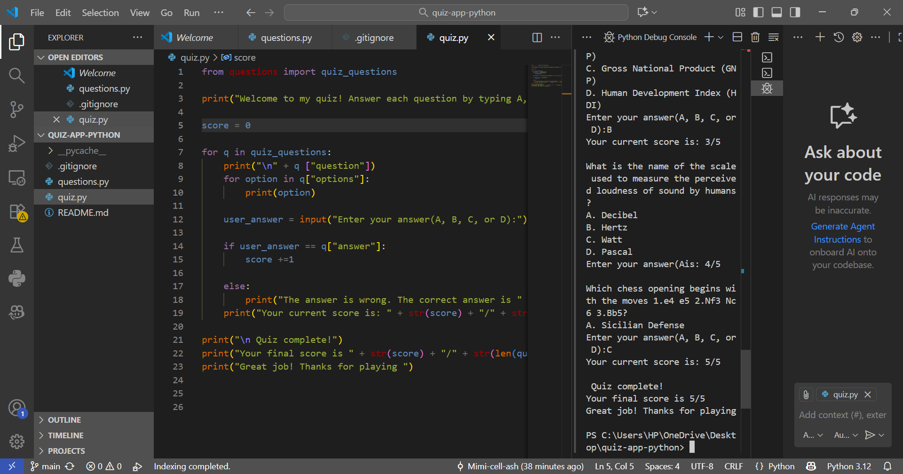

# 🧮 Python Quiz App

A simple **command-line quiz application** built in Python 🎯  
It tests users with multiple-choice questions and shows their score at the end.  

---

## 🧠 Features
- Asks multiple-choice questions  
- Checks answers automatically  
- Shows the correct answer when wrong  
- Tracks your current score in real-time  
- Displays final results after all questions  

---

## ⚙️ How to Run
1. Clone this repository:
   ```bash
   git clone https://github.com/Mimi-cell-ash/quiz-app-python.git
   cd quiz-app-python

   ---

## 🖼️ Demo

Here’s what the quiz looks like when running in the terminal:




